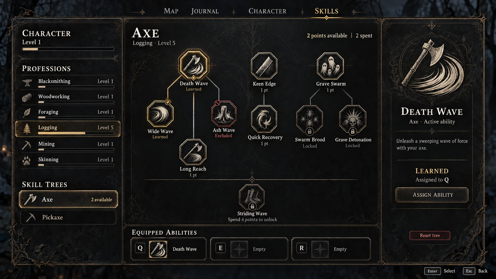

# UI roadmap

This roadmap moves the game's screens and HUD to one shared dark-fantasy style.
It records the accepted decisions and the task sequence. The style itself
(tokens, assets, rules) is in [ui-style-guide.md](ui-style-guide.md).

## Problem

- **No shared style:** every screen typed its own colours and fonts into its
  Widget Blueprints, including the skill screen. There were no UI materials and
  no CommonUI default styles.
- **Crafting:** the screen looked flat and had no fantasy atmosphere. Most of
  its view model data (recipe states, output preview, job state, filters) was
  never shown.
- **Inventory:** `CUI_PlayerInventoryPane` scales down to fit, so it shrinks
  inside the storage and crafting screens. Its cells then differ in size from
  the storage grid next to it.
- **Equipment:** the gear slots had no empty-slot silhouette, label or frame.
- **HUD:** three plain progress bars, of which only health was bound.

## Decisions

| Topic | Decision |
| --- | --- |
| Base style | The skill screen (HARV-09b): subtle, easy to restyle and extend. |
| Mood | An old occult register: blackened iron, bone white and matte old gold. Calm, dark and high-quality, with subtle engravings and clearly readable information. The base colours come from the skill screen concept below. |
| Fonts | Headings in Cinzel (SIL Open Font License, [third-party-notices.md](third-party-notices.md)), body text and numbers in Roboto. KnightsQuest has an unclear licence and is not used in new work. |
| Materials | Subtle procedural UI materials driven by one palette (`MPC_UI_Palette`), restyled through material instance parameters. Seals, locks, diamonds, fine lines and edge scratches are procedural too; there are no filigree textures. The `fantasy_gui_4` marketplace frames are not used. |
| Icons | One engraving material makes the existing icons monochrome in bone white or old gold and dims locked ones. A real engraved icon set can replace the textures later. |
| Inventory | Tarkov-style paper doll and container grids with one cell size everywhere. The standalone inventory shows three columns: equipment, containers and character stats. |
| HUD | Health, stamina and mana bars; mana is prepared but hidden until a pawn has a mana attribute. An XP bar. Positions may change so the HUD stays out of the way during play. |
| Controller support | Wanted later; every task keeps visible focus states, no mouse-only actions and scroll-into-view on focus (see the style guide). |
| Base terminal | Out of scope: it is a leftover of the old inventory whose screen route was removed ([physical-storage-implementation.md](physical-storage-implementation.md)). |

## C++ boundary

- **Classification:** designer-owned presentation on top of existing view
  models. Fonts, palette, materials, styles and layouts are assets.
- **Native work:** read models only where data is missing (UI-01b profession
  icons, UI-03 character stats, UI-04 station name, UI-05 mana), plus test
  updates where tests froze presentation structure.

## Tasks

| ID | Scope | Status |
| --- | --- | --- |
| UI-01 | Style foundation: Cinzel font, palette collection, UI materials, CommonUI text, button and border styles, editor template styles, skill screen as proof, style guide | Done: [#198](https://github.com/Athurito/SurvivalRpg/pull/198) |
| UI-01b | Skill screen after the concept: art set, octagonal plaques with five states, seals and locks, framed panels, detail panel, Q/E/R slots with icon and key, profession icons, menu tab bar and backdrop | Done: [#199](https://github.com/Athurito/SurvivalRpg/pull/199) |
| UI-02 | Tarkov inventory: pane in columns, one shared cell size, new gear and carry slots, storage and crafting hosting, presentation-only test contracts relaxed | Done: [#200](https://github.com/Athurito/SurvivalRpg/pull/200) |
| UI-02b | Gameplay icons: the user's 59-icon package for items, skills, gear glyphs, buildables, upgrades, stats and crafting; icons keep their aspect ratio in fixed boxes; weapon slots turn long weapons | Done: [#201](https://github.com/Athurito/SurvivalRpg/pull/201) |
| UI-02c | Coloured item icons: the user's colour version of the gameplay package replaces the 39 item textures in place; every other icon stays bone white | In review: [#203](https://github.com/Athurito/SurvivalRpg/pull/203) |
| UI-03 | Character stats column (level, XP, load, health, stamina, armour), rarity frames on gear slots, MVVM toolset | In review: [#202](https://github.com/Athurito/SurvivalRpg/pull/202) |
| UI-04 | Crafting screen: layout, station name, recipe states, categories and search, output preview, job state | Planned |
| UI-05 | HUD: new arrangement, material bars for health, stamina and mana, XP bar, context fading, action bar and Q/E/R, enemy health bar | Planned |
| UI-06 | Tooltip, context menu, split and drop dialogs, toasts, drag visual, item-only highlight in grids | Planned |
| UI-07 | Menus (game menu tabs, main menu, settings, respawn), then remove KnightsQuest | Planned |

## Noted for later tasks

- **Item-only highlight in grids (UI-06):**
  - Hovering or selecting a multi-cell item, for example the 1 × 2 basic sword
    in the pockets, outlines the item. The grid cell under the pointer also
    draws its own hover or selection frame.
  - Only the item should be outlined. A cell covered by an item draws no frame
    of its own; empty cells keep theirs. Controller focus on an occupied cell
    highlights the item the same way.
  - The cell states live in `URpgInventorySpatialCellWidget`. The address slot
    view model already reports whether a cell is an item's origin or covered
    by it.

## Open findings outside UI

- **Character XP curve:** `DA_PlayerProgression` has no `XPToNextLevel`
  curve.
  - `URpgPlayerProgressionComponent::TryLevelUp` stops when the next level
    costs nothing, so the character level never rises.
  - The stats column (UI-03) therefore shows only the experience (`10 XP`)
    with an empty bar.
  - This is progression content and is fixed in a separate task. Once the
    curve is assigned, the column shows `XP / next` without UI changes.

## Style foundation (UI-01)

- **Assets:** the palette, materials, fonts and styles listed in the style
  guide, under `Content/SurvivalRpg/UI/Styles` and
  `Content/SurvivalRpg/UI/Fonts/Cinzel`.
- **Editor defaults:** `Config/DefaultEditor.ini` sets the CommonUI template
  styles, so newly placed text blocks, buttons and borders start with the
  shared Body, Default and Panel styles.
- **Skill screen:** `CUI_Skills`, `CUI_SkillTreeNode`, `CUI_TradeSkillEntry`
  and `CUI_SkillTreeListEntry` now use the shared text styles and material
  brushes. Their layout and graphs are unchanged.
  - The node keeps `SetBackgroundColor` per state. Its brushes come from the
    tinted frame instances, which use a dark neutral fill, so each state colour
    reads as a dark tone of itself.
  - The grid links use the palette colours.
- **Palette at runtime:** the palette is a material parameter collection, so a
  later system (for example corruption) can recolour every UI material at
  runtime. A PIE test changed two palette colours and the skill screen followed
  at once.

## Skill screen concept (UI-01b)

The user's concept (2026-10-07) is the target for the skill screen and the
reference for every later screen. Priority: first unify colours and materials
(done in UI-01), then icons and readability, then the detail panel, ability
slots and animations.

- **Colours:**
  - background charcoal `#101214`, panels matte iron `#1B1D20`;
  - text bone white `#DDD4C2`, secondary text warm ash `#A39D92`;
  - learned and accents matte old gold `#AD915A`;
  - exclusions and warnings muted blood red `#824747`;
  - scratches, soot and ornaments mainly at the edges, calm surfaces behind
    text.
- **Nodes:** uniform octagonal metal plaques with engraved symbols. States
  differ in colour, sign and label:
  - learned: gold frame and a small seal;
  - learnable: light edge, clear icon and point cost;
  - locked: dimmed icon, lock and the readable prerequisite;
  - excluded: broken seal in subtle red;
  - selected: an extra outer focus frame.
- **Icons:** one set in engraving or woodcut style, with clear silhouettes,
  equal stroke width, few colours and the same detail density.
- **Tree:** generous spacing and unambiguous links that look like fine inlaid
  channels; unlocked links get a gold accent. Advanced tiers sit behind subtle
  tier dividers with readable prerequisites.
- **Layout:** serif headings and important names, a calm readable font for
  descriptions, values and hints.
  - Left: character, professions, skill tree selection.
  - Middle: the tree.
  - Right: details of the selected ability.
- **Navigation and slots:**
  - Active menu entries get gold text and a fine marker.
  - Q/E/R are three compact slots with the ability icon, its name and a
    separate key badge.
  - Input hints follow the active input device.
- **Animations:** short and subtle:
  - edges brighten on selection;
  - a light pulse runs along unlocked links;
  - a seal is stamped when a node is learned.

### Implementation (UI-01b)

- **Art set:** the user's generated art lives in `Content/SurvivalRpg/UI/Art`
  ([third-party-notices.md](third-party-notices.md)):
  - icons for skills, professions, skill tree categories, crafting and
    navigation;
  - panel, tooltip and slot frames, plus button, tab, progress and divider
    controls;
  - two ornaments and two backgrounds.
  - Icons are 512 px. Frames are trimmed to their visible band and at most
    1024 px. All are imported as UI textures without mips.
  - Skill nodes, both tool trees and all six professions point at the new
    icons. The four remaining pickaxe nodes (Rift Grip, Wide Rift, Deep Grip,
    Steady Hands) got theirs in UI-02b.
- **Profession icons:** `FTradeSkillConfig::Icon`, exposed through
  `URpgTradeSkillProgressionComponent::GetSkillIcon` and
  `URpgTradeSkillViewModel`. This is the only native change.
- **Nodes:** `CUI_SkillTreeNode` is an octagonal plaque, `M_UI_Panel` with
  `Chamfer`. Its state colour only tints the frame and glow
  (`TintFillAmount`).
  - Learned: gold frame and a seal.
  - Learnable: bone frame and the point cost.
  - Unaffordable: ash.
  - Locked: dark frame, dimmed icon, a procedural lock and the prerequisite.
  - Excluded: a blood-red frame and a forbidden sign.
  - The selected node gets an outer ring.
- **Screen:** `CUI_Skills` has three framed panels on the night forest
  backdrop:
  - Left: character, professions with icons, and skill trees; the selected
    tree has a gold frame.
  - Centre: the tree over a faint ritual tree sigil, and the equipped
    abilities. Each Q/E/R slot shows a key badge, the ability icon and its
    name.
  - Right: the detail panel with the icon, name, tree and kind, description,
    state, slot, an Assign Ability button and Reset tree.
- **Assign Ability:** moves the selected learned ability to the first empty
  slot. If it already sits in a slot, it moves to the next one.
- **Menu tabs:** the shared tab styles in
  `Content/SurvivalRpg/UI/Menus/Shared/Modular/TabList` use Cinzel in ash. The
  active tab is gold with an underline marker and a diamond (`M_UI_Glyph` type
  3). This also changes the settings menu tabs.
- **Not done:**
  - Animations: the pulse along unlocked links and the seal stamp on learning.
  - Full gamepad focus styling of the plain node and slot buttons.

## Tarkov inventory (UI-02)

- **One cell size:** every grid uses 56-unit cells with 2 units of padding,
  from the class defaults of `CUI_SpatialInventoryGrid`. The player pane no
  longer sits in a scale box, so its grids keep that size in the inventory,
  storage and crafting screens.
- **Art:** the user's gear package adds equipment glyphs (`Icons/gear`), cell,
  equipment, weapon and container frames, and a paper doll figure
  ([third-party-notices.md](third-party-notices.md)). Slate draws frame
  margins in texture pixels, so the frames are exported at their on-screen
  size ([ui-style-guide.md](ui-style-guide.md#art-set)).
- **Pane (`CUI_PlayerInventoryPane`):** two framed columns and a quick access
  row instead of the fixed canvas.
  - Equipment: the paper doll between the armour slots (head, chest, hands,
    legs, feet) on the left and the off hand and bag slots (backpack, belt,
    pouch, resource bag) on the right. Weapon I and II sit below in wide
    weapon frames. Each slot has a caption.
  - Containers: pockets and every equipped bag, each with a Cinzel title, an
    optional glyph and its grid inside the container frame. A bag's section
    appears only while the bag is equipped. The column scrolls, and a scroll
    box brings the focused grid into view.
  - Quick access: the 1–8 quickbar below both columns.
- **Slots (`CUI_GearSlot`, `CUI_CarrySlot`):**
  - The frame is the CommonUI button style: dim at rest, bright on hover and
    focus.
  - An empty slot shows its glyph; the glyph is set per slot.
  - A ring shows focus, the held source, and valid or invalid drop targets.
  - The weapon or off-hand item in hand glows gold.
- **Cells and items:** cells show the cell frame over an iron fill; the native
  cell states tint the frame with palette colours. Items sit on a lighter
  plate, and stack counts use `CUI_TextStyle_StackCount`. The drag visual's
  state colours follow the palette.
- **Screens:**
  - Inventory (`CUI_PlayerInventory`): the night forest backdrop of the game
    menu, the pane centred, a framed Build Chest button.
  - Storage (`CUI_StorageSpatial`): Inventory and Storage titles that light up
    with the active side, a framed storage column, the storage grid in the
    container frame with a scroll box, and restyled storage controls.
  - Crafting (`CUI_CraftingStationSpatial`): the backdrop and the pane at its
    natural width. The crafting side keeps its scale box until UI-04.
- **Tests:** the content-host test no longer freezes canvas positions,
  parents and child order, and the carry-slot test no longer freezes indicator
  alpha. `CUI_InventorySlotButtonStyle` lost its last users and is retired.
- **Not done:**
  - The character stats column (UI-03).
  - Glyphs for pouch and resource bag; UI-02b adds them.
  - The crafting output grid is still scaled with the crafting side (UI-04).
  - The quickbar entries keep the HUD look (UI-05).

## Gameplay icons (UI-02b)

- **Art:** the user's package of 59 engraved icons
  ([third-party-notices.md](third-party-notices.md)), 512 px on the long
  edge, imported with mips into `Content/SurvivalRpg/UI/Art/Icons`:
  - `items`: 35 items and 4 dev placeholders (bow, arrows, spell focus, kiln
    kit);
  - `skills`: the four pickaxe nodes;
  - `gear`: pouch and resource bag glyphs, scaled to 256 px like the other
    glyphs;
  - `building`: shared chest, wood storage, Rift Containment and Auto Deposit;
  - `stats`: character values, used by the stats column since UI-03;
  - `crafting`: crafting categories and stations, imported for UI-04 and not
    wired yet.
- **Wiring:**
  - All 43 item definitions (`RpgInventoryFragment_UIData`), the test
    backpack's container icon, and the nine recipes, which show their output
    item.
  - The four pickaxe skill nodes. The ability icons of Rift Grip, Death Wave,
    Grave Swarm and Striding Wave now use the skill icons.
  - Both buildables and both storage upgrades.
  - The pouch and resource bag slots and container headers in
    `CUI_PlayerInventoryPane`.
- **Footprints:** the grid stretches an icon over its footprint, so two items
  now match their art: the basic two-handed sword is 1 × 3 (it was 1 × 1 and
  had no `UIData` fragment, so no icon), and the test sword is 1 × 2 like the
  basic sword.
- **Aspect ratio in fixed boxes:**
  - Gear slots, the HUD quickbar, the quick access wheel and the crafting
    recipe, ingredient, job and selection icons now sit in a `ScaleBox`, and
    their brushes take the texture size.
  - Native: the icon setters of the carry slot, wheel and crafting widgets pass
    `bMatchSize`. The Blueprint `SetSlotIcon` functions of `CUI_GearSlot` and
    `CUI_ActionBarSlotEntry` do the same.
- **Weapon slots:** `URpgInventoryCarrySlotWidget::bTurnPortraitIcons` turns a
  portrait icon a quarter turn. The brush swaps its size, and the inverse
  render scale from `CalculateIconRenderScale` restores the aspect before the
  turn. Weapon I and II enable it, so swords, axes and pickaxes lie across the
  wide frame.

## Coloured item icons (UI-02c)

- **Why:** with every item in bone white, a full backpack read as one pale
  surface, and items were hard to tell apart at a glance.
- **Art:** version 2.0 of the user's gameplay package
  ([third-party-notices.md](third-party-notices.md)) colours the 35 items and
  the 4 dev placeholders in material colours. The engraving style and the
  motifs stay the same:
  - wood and leather brown, iron cool grey, copper warm red, cloth muted olive;
  - plants, berries and meat in natural colours;
  - rift materials and magic foci violet, with a small cyan accent.
- **Import:** the 39 textures in `Icons/items` were re-imported in place with
  the same names, sizes and settings, so no item, recipe or widget reference
  changed.
- **Unchanged:** the other 20 icons of the package (skills, gear glyphs,
  building, stats, crafting) stay bone white; their colour version is
  identical.

## Character stats (UI-03)

- **Column:** `CUI_CharacterStats` is a framed panel like the equipment and
  container columns. It shows:
  - level with the experience bar and text;
  - health and stamina with value and bar;
  - armour;
  - load with its tier, a bar up to the heavy threshold, and kilograms.

  Its icons come from `Icons/stats`; load uses the backpack glyph.
  `CUI_PlayerInventoryPane` hosts it as a third column behind the designer
  variable `bShowCharacterStats`. Only `CUI_PlayerInventory` turns it on;
  storage and crafting keep two columns.
- **Read model:** `URpgCharacterStatsViewModel` mirrors gameplay state:
  - level and experience from `URpgPlayerProgressionComponent`;
  - health, stamina and armour from the pawn's ability system;
  - load and tier from the equipment loadout message.

  It also offers display text and bar fractions, so the widget binds property
  to property. `URpgUiSubsystem` owns one per local player and rebinds it after
  a respawn. Widgets get it through `URpgLocalPlayerViewModelResolver`, which
  `Config/DefaultModelViewViewModel.ini` makes the default resolver. The HUD
  (UI-05) can bind the same instance. `URpgEquipmentLoadoutComponent` exposes
  `GetHeavyLoadThreshold` for the load bar.
- **Rarity frames:**
  - The gear and carry slot view models expose the generated `Rarity` of the
    item, and Common for items without a roll.
  - `CUI_GearSlot` and `CUI_CarrySlot` draw a `RarityRing` inside the frame
    through their `SetRarityRing` function. `MI_UI_RarityRing_Uncommon`,
    `_Rare` and `_Epic` take the palette rarity roles; Common shows no ring.
  - In the weapon slots the ring lies above the gold glow of the weapon in
    hand.
- **MVVM toolset:** the project enables the engine's `MVVMToolset`, so view
  models and property bindings are authored through Unreal MCP; the stats
  column is bound entirely through it. `AssetContractTools` adds the two
  missing pieces: a binding to a widget function (`add_view_function_binding`)
  and a function input of an enum, struct or object type
  (`add_function_input`). The skill reference
  [unreal-mcp-asset-authoring.md](../.agents/skills/unreal-lyra-expert/references/unreal-mcp-asset-authoring.md#widget-blueprint)
  describes them.
- **Not done:**
  - Mana, which UI-05 adds once a pawn has the attribute.
  - `DA_PlayerProgression` has no `XPToNextLevel` curve, so the experience bar
    stays empty and the text shows only the experience (for example
    `10 XP`). The curve is progression content, not UI.
  - Items in the grids show no rarity yet, and the tooltip keeps its own
    rarity colours (UI-06).
